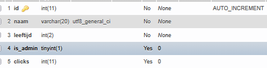

# Gegevenssprint

een php project waar het doel op de site is zoveel mogelijk clicks verzamelen
je kunt een gebruiker aanmaken met een uniek inlog systeem  naam + leeftijd 
je kunt je accounts naam veranderen verwijderen en clicks reseten
export mogelijkheden zijn excel en pdf je kunt ook je database downloaden
php versie: php 8.1.0
Dit project maakt gebruik van **Composer** 

## 🚀 Installatie

1. Clone dit project:
   ```bash
   git clone https://github.com/okwastaken/gegevenssprint
   cd gegevenssprint

2. cmd 
Installeer dependencies met Composer
Open CMD of Terminal in de projectmap en voer uit:
 ```
composer install 

3. Maak een .env-bestand aan
Kopieer het voorbeeldbestand: 
```
cp .env.example .env

# Database

1. **Maak een nieuwe database aan in phpMyAdmin**  
   - Ga naar: http://localhost/phpmyadmin
   - Klik op **Nieuwe database**  
   - Geef een naam, bijvoorbeeld `example_db`
    of importeer backup bestand die in backup folder staat
   

3. **Pas de databasegegevens aan in je `.env`-bestand**  
   ```dotenv
    vul dit in met je mamp wachtwoord en gebruikersnaam host en db naam
    DB_HOST=example_host
    DB_USER=example_user
    DB_PASS=example_pass
    DB_NAME=example_db